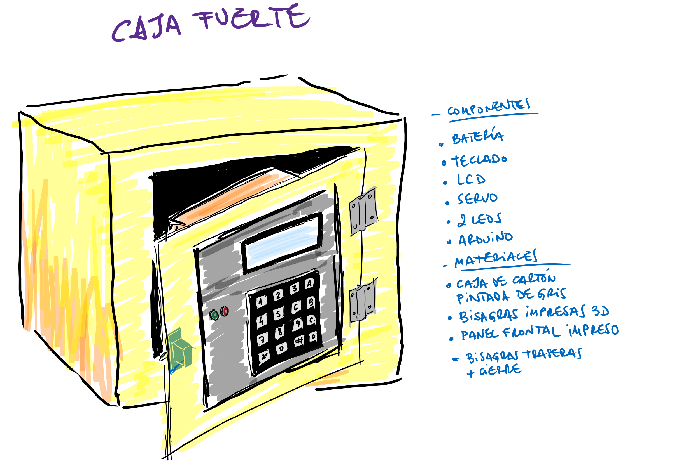
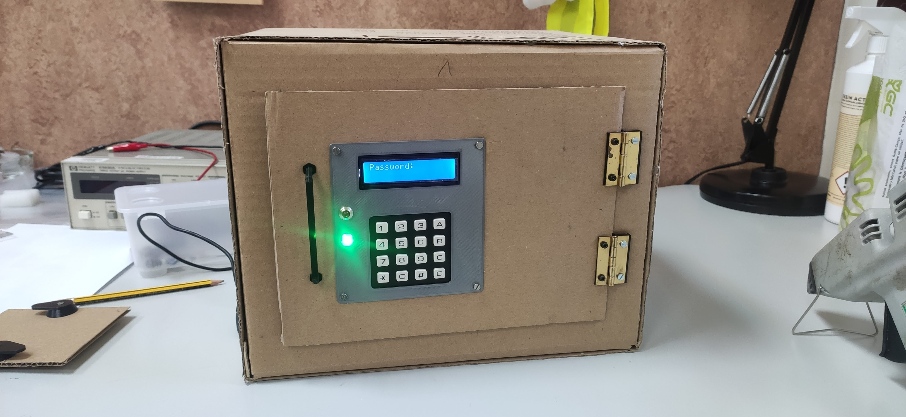
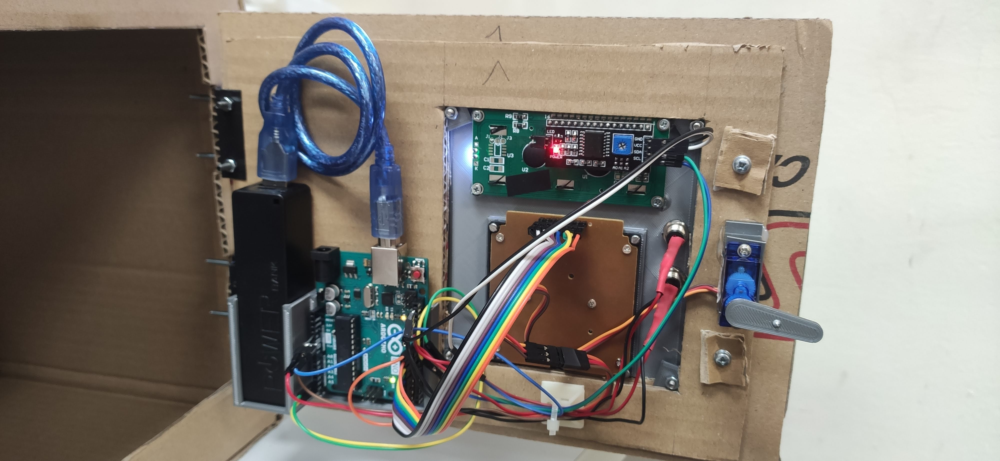
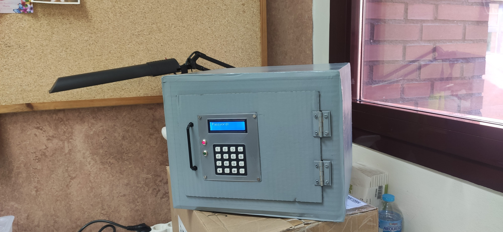

# Caja Fuerte con Arduino
* Este pequeño proyecto se utiliza en 
<a rel="license" href="https://www.uc3m.es/secundaria/divulgacion-ciencia/viernes-tecnologicos">ElectroEscape: usa la electrónica para ser libre</a> dentro de los **Viernes Tecnológicos** organizados por la *Universidad Carlos III de Madrid*

* Consiste en la fabricación de una caja fuerte "de cartón" y cuya apertura está controlada por un Arduino UNO.

## Idea
</a>

## Imágenes
* Caja de cartón

</a>

* Electrónica y Arduino

</a>
* Caja acabada

</a>

## Código Arduino

# 
# Licencia

 prueba por Juan Pedro Perianes Rodríguez se distribuye bajo una <a rel="license" href="http://creativecommons.org/licenses/by-sa/4.0/">Licencia Creative Commons Atribución-CompartirIgual 4.0 Internacional</a>.
